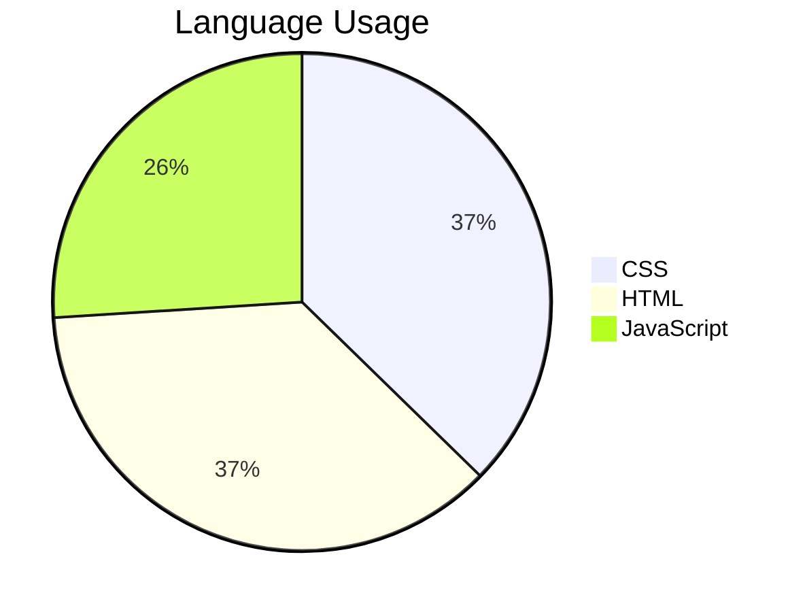

# 🚀 Web Development Learning Journey  
**Projects, experiments, and growth in HTML, CSS, and JavaScript**  
Welcome to my **Web Development Journey** repository! This is where I document my progress and projects as I dive into the world of web development. Let's build something amazing together! 🚀

---

## 🎯 Featured Projects  

### 🎲 **Dice Game Challenge**  
**Tech:** HTML, CSS, JavaScript  
**Highlights:**  
- Random dice rolls with `Math.random()`  
- Dynamic winner announcement  
- Clean UI with CSS animations  
**Lesson Learned:** Mastered DOM updates and event-driven logic.  
**Live Demo:** [Play Here!](https://ciiphersiren.github.io/learning-webdev/dice-game)  

### 🥁 **Interactive Drum Kit**  
**Tech:** HTML, CSS, JavaScript  
**Highlights:**  
- Keypress-triggered audio playback  
- Visual button animations  
- Fully responsive design  
**Lesson Learned:** Deepened understanding of `addEventListener` and audio APIs.  

### 🔍 **Google Search Clone**  
**Tech:** HTML, CSS  
**Highlights:**  
- Pixel-perfect replica of Google's UI  
- Functional search inputs  
- Advanced search page  
**Lesson Learned:** Precision in CSS positioning and form handling.  

### 🧠 **Simon Memory Game**  
**Tech:** HTML, CSS, JavaScript  
**Highlights:**  
- Increasing difficulty levels  
- Sound feedback system
- Cute UI
**Lesson Learned:** Applying framework concepts of jQuery.

### 🌱 **Beginner Projects**  
- **`hello.html`** - First steps in HTML  
- **`basic-elements.html`** - Core HTML tag practice  

---

## 🛠️ Technical Showcase  

---

## 📬 Connect & Collaborate  
- **GitHub**: [@ciiphersiren](https://github.com/ciiphersiren)  
- **Email**: [reet](reet.ritul0211@gmail.com)
- **LinkedIn**: [@ciiphersiren](https://www.linkedin.com/in/ciiphersiren)
- **Feedback Welcome!** Open to:  
  - Code reviews  
  - Project ideas  
  - Hackathon collaborations  

---

## 🌟 What's Next?  
- [ ] Adding React projects  
- [ ] Implement backend functionality  
- [ ] Create project tutorial videos  

**Last Updated:** June 2025

Let's code and create together! 💻✨
